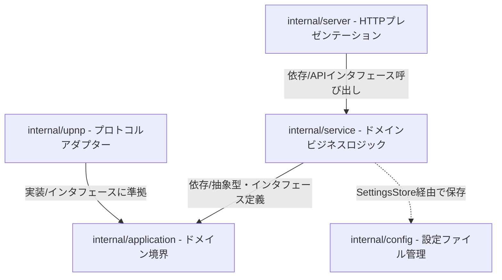

# 🚀 AI Agent 開発ガイドブック - Porto Architecture & Best Practices

ようこそ、Porto（ポルト）のコードベースへ！  
本書は、本プロジェクトの設計思想、アーキテクチャ、実装ガイドライン、およびこれまでのリファクタリングで得られた知見をまとめた、**後続の AI エージェント（Gemini, Claude 等）のための開発手引書**です。

---

## 📌 Porto の概要とビジョン

Porto（`/ˈpɔːr.toʊ/`）は、**「シンプル、安全、エレガント」**を極限まで追求したローカル UPnP ポートマッピング管理ツールです。
複雑なルーター設定を行うことなく、ゲーム（Minecraft等）や各種ローカルサーバーのポートを外部公開するための軽量なデスクトップAPI＆SPAとして設計されています。

---

## 🏗️ クリーンレイヤードアーキテクチャ設計

本プロジェクトは、関心の分離（Separation of Concerns）と依存関係逆転の原則（DIP）に基づき、以下の 4 つの独立したレイヤーで構成されています。



### 各レイヤーの責務とルール

| パッケージ | 役割と責務 | 厳守すべき依存ルール |
| :--- | :--- | :--- |
| **`internal/server`** | HTTP APIのルーティングおよびSPA静的ファイルの配信。SPAルーティングのフォールバック処理。 | `upnp` パッケージを直接インポートしてはならない。ビジネスロジックは `apiService` インターフェースを介してのみ呼び出す。 |
| **`internal/service`** | ポートマッピング、設定の変更、ルーター探索、同期などのコアビジネスロジックの実装。 | `upnp` または `server` パッケージに依存してはならない。ルーター操作や探索は `application` の抽象インターフェースを通じて実行する。 |
| **`internal/application`** | ドメインモデル（`PortMapping`等）およびサービス境界インターフェース（`PortMapper`, `DiscoveryClient`）の定義。 | プロジェクトで最も純粋なドメイン層。どの内部パッケージ（`server`, `service`, `upnp`等）にも依存してはならない。 |
| **`internal/upnp`** | SSDPによる探索、XML解析、SOAP通信によるポート開閉の具体的な通信処理。 | アプリケーションの具象アダプター。`application` の各種インターフェース（`PortMapper`, `DiscoveryClient`）を実装する。 |

---

## 🔒 セキュリティ・ポリシー

1. **ローカルバインドの強制検証（Localhost Binding Only）**
   - Porto はローカルPC上で動作する個人用の管理ツールです。
   - バックエンドのHTTPサーバーが誤って外部インターフェース（`0.0.0.0`等）にバインドされ、悪意ある第三者にAPIを操作されるのを防ぐため、`config.ValidateLocalListenAddr` によって `localhost`, `127.0.0.1`, `::1` 以外のバインド要求は起動時および設定更新時に**例外なくエラーとして却下**します。

2. **外部ポート競合の回避（Default Port `61234`）**
   - Web開発用のデフォルトポート（`8080`等）との競合を防ぐため、デフォルトのリスンポートにはプライベートポート範囲の **`61234`** が採用されています。

---

## 🔌 UPnP プロトコル実装の知見

1. **探索（Discovery）の二重フォールバック**
   - ルーターによってはSSDPマルチキャスト（`239.255.255.250:1900`）に応答しない、または異なるネットワークセグメントからの探索を無視する場合があります。
   - そのため、SSDPの応答が得られない場合の防衛策として、**デフォルトゲートウェイIPの想定ポート（5000, 49152, 1900）および既知の記述パス（`/rootDesc.xml`等）に対する直接接続プローブ（並行ポーリング）**を実装し、高いルーター検知率を誇っています。

2. **WPS/WFAデバイスの除外**
   - 探索時にWi-Fi Allianceのプロトコルデバイス（`wps_device`等）が応答することがありますが、これらはポートマッピング機能を持たないため、SSDPレスポンス解析時に `isWFAResponse` メソッドによって除外します。

3. **検出タイムアウトのソフトフォールバック**
   - ルーター未検出やネットワーク瞬断はユーザーの日常的な操作範囲内です。そのため、探索エラー（`ErrNoGateway`）は致命的なシステムエラーとせず、現在の「未検出ステータス」を無害に返すソフトエラーとしてハンドリングします。

---

## 🧪 開発・テストのベストプラクティス

1. **テストで本物のネットワークI/Oを行わない（Test Doubleの活用）**
   - `server` のテストには、`apiService` のモックである `fakeAPIService` を使用します。
   - `service` のテストには、`config.FileStore` の代わりにメモリ上で動作する `recordingSettingsStore` を、`upnp` クライアントの代わりに `fakeMapper` を注入します。これにより、テスト実行速度を極限まで高めています。

2. **日本語 Doc コメント規約（Go doc 準拠）**
   - Porto のコードベースはすべて、自然で読みやすい日本語による Go 標準のドキュメントコメントで整備されています。
   - `go doc` コマンドで美しく表示させるため、エクスポートされた名前は必ず識別子名から開始します（例：`// App は...`）。
   - パッケージ全体の解説コメント（`// Package ...`）の重複を防ぐため、パッケージ説明は1パッケージにつき**特定の1ファイルのみ**（通常は主要構造体が定義されているファイル）に記述します。

---

## 🛠️ コマンドリファレンス

後続のエージェントは、作業前に以下のコマンドで整合性を確認してください。

```bash
# バックエンドのすべての単体テストを実行する
cd backend && go test ./...

# アプリケーション全体のドキュメントをターミナルで確認する
go doc ./internal/app
go doc ./internal/service
go doc ./internal/server

# ローカルでブラウザから美麗なドキュメントUIを起動する
go run golang.org/x/pkgsite/cmd/pkgsite@latest
```

---

*Porto のコードベースは常にクリーンで、美しく保たれています。後続のあなたも、この哲学を受け継ぎ、エレガントなコードを紡いでくれることを期待しています！* 🚀
